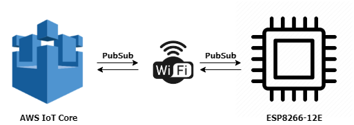
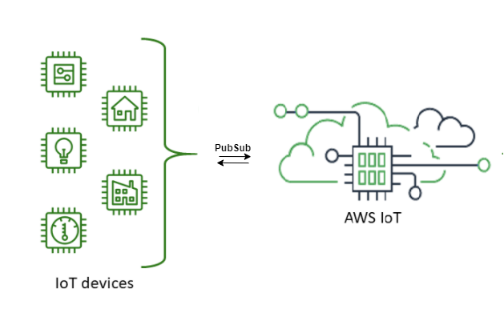

# AWS IOT CORE-ESP8266
## Overview

  

  

 

  
  
I have used a `publish`and `subscribe` method for current demonstration.**ESP8266-12E** module incuded as a microcontroller for the communication with **AWS IoT Core**.

Here we have some points to note:

> - You must need an **AWS IoT Core** console/account for the demonstation.Details on below section (**Steps**). 
> - This concept works on ESP8266 Arduino Core v2.4.2 and v2.4.0.
> - Communications are secured by TLS version 1.2. Arduino IDE & ESP8266 Suports TLS V1.2.
> - **AWS IoT Core** supports `MQTT` and `MQTT over WSS` protocols. We are using ***MQTT over WSS*** method with ***sigv4*** authentication and port **443**.

## Software
* [Arduino IDE](https://www.arduino.cc/en/Main/Software) for Windows, Linux or Mac OS.

## Steps :
 1. **Download** the repo.
 
 2. For those who don't have an ***AWS IoT core*** 😇 download the ***AWS IOT CORE WITH ESP8266*** named pdf from the **DOC** folder and carefully read it. 
     Create a dashboard with at least one ***thing***. Create your **AWS** account [here](https://aws.amazon.com/).
   
 3. Open **LIB** folder from the downloaded repo then extract the `ZIP` file and place the four folders into your Arduino local directory folder
    (libraries). Folders(libraries) with name given below :
    
    - aws-mqtt-websockets-master
    - AWS-SDK-ESP8266
    - PubSubClient
    - WebSockets
    
    You have an alternate option to download the library from the Arduino library manager. But I am not suggesting that way in this case 👎. 
    
 4. The **source code** for our ESP8266 simulation can be found in the **CODE** folder. Open **source code** from the downloaded repo and make some changes as mentioned below :
   
   - Open **global.h** and provide your wifi router's `ssid` and `password` :
    

  

  
  
   - Open **aws.cpp** and fill your credentials here 👇 . For more info refer the document page ***number 9***.     
      

  

 
  
## Compatibility
This library was tested with the NodeMCU V1.0 & ESP8266-12E board. It should also work with other standard ESP8266 that are compatible with the Arduino IDE.
ESP8266 core version that I have tested is `2.4.2`. 

## Working & Testing 
Demonstration of `publish` and `subscribe` between **ESP8266** and **AWS IoT Core** dashboard described in the documentation from ***page No:10 to 13***. 

WiFi Connection status :

 

  

 

  

 

  

 

  
</p    
